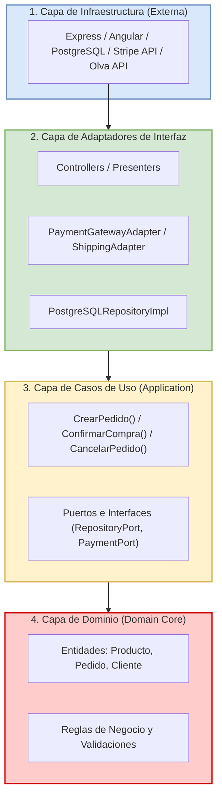

# Enfoque Arquitectónico: Clean Architecture

## 1. Propósito
El enfoque de **Clean Architecture (Arquitectura Limpia)** se aplica para gobernar las dependencias internas del código tanto en el backend como en el frontend Angular. Su objetivo principal es asegurar la **Regla de Dependencia**: el código fuente solo debe apuntar hacia adentro, haciendo que el Dominio sea completamente agnóstico de frameworks, controladores, protocolos de transporte y librerías externas.

## 2. Estructura de Capas y Responsabilidades

| Capa | Responsabilidad | Elementos de Ejemplo |
| :--- | :--- | :--- |
| **Dominio (Entities)** | Modela los conceptos y reglas de negocio esenciales. No tiene dependencias de ningún framework o biblioteca externa. | `Producto`, `Pedido`, `Cliente`, `Value Objects`, `Reglas de Negocio`. |
| **Casos de Uso (Application)** | Orquesta los flujos de la aplicación y define la interacción entre las entidades y los puertos secundarios. | `CrearPedidoUseCase`, `ConfirmarCompraUseCase`, `CancelarPedidoUseCase`. |
| **Adaptadores de Interfaz (Adapters)** | Convierte los datos del formato externo al requerido por los casos de uso y viceversa. | `PedidoController`, `ProductoRepositoryImpl`, `PaymentAdapter`, `DTOs`. |
| **Infraestructura (Frameworks & Drivers)** | Aloja las herramientas técnicas, frameworks web, bases de datos y clientes HTTP. | `Express`, `PostgreSQL`, `Stripe SDK`, `Angular Material`. |

## 3. Diagrama de Enfoque y Dependencias

## 4. Reglas de Dependencia del Código
* **Aislamiento del Dominio:** Las entidades no deben contener anotaciones, decoradores de ORM ni tipos de datos propios de Angular o Express.
* **Inversión de Control (DIP):** Los Casos de Uso definen interfaces (puertos) para la persistencia o los servicios externos; las capas externas se encargan de implementar dichas interfaces (adaptadores).
* **Testabilidad:** Los Casos de Uso y las Entidades se prueban de manera unitaria y rápida sin necesidad de levantar bases de datos ni servidores web.