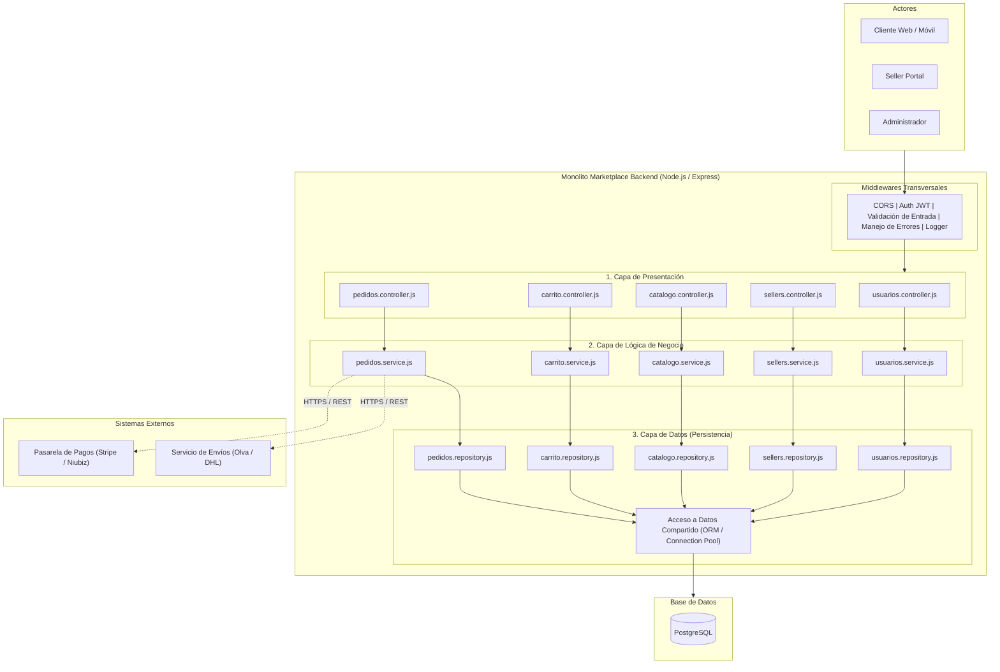

# Estilo Arquitectónico: Monolito Modular en Capas

## 1. Contexto y Selección
Para el Marketplace de productos para mascotas se ha seleccionado el estilo **Monolito Modular organizado en N-Capas**. Esta decisión unifica el despliegue del backend en un único entorno de ejecución (Node.js/Express), manteniendo límites de aislamiento lógicos entre los módulos funcionales para facilitar la evolución hacia microservicios en el futuro sin la sobrecarga inicial de infraestructura.

## 2. Componentes Principales
* **Capa de Presentación:** Enrutadores y controladores HTTP encargados de validar entradas, gestionar sesiones y responder payloads en JSON.
* **Capa de Lógica de Negocio (Módulos):** Servicios de aplicación que implementan las reglas funcionales de Usuarios, Sellers, Catálogo, Carrito y Pedidos.
* **Capa de Datos:** Abstracción y acceso a la persistencia mediante ORM y pools de conexión compartidos hacia la base de datos relacional.
* **Sistemas Externos:** Pasarelas de pago y proveedores logísticos integrados mediante adaptadores específicos.

## 3. Diagrama de Estructura Global

## 4. Reglas de Arquitectura
1. Cada capa sólo puede invocar a la capa inmediatamente inferior.
2. Un módulo funcional no accede directamente a los repositorios o tablas de otro módulo.
3. La comunicación intermódulo se realiza estrictamente a través de interfaces de servicio autorizadas.
4. Todo el backend se ejecuta en un único proceso Node.js conectado a PostgreSQL.